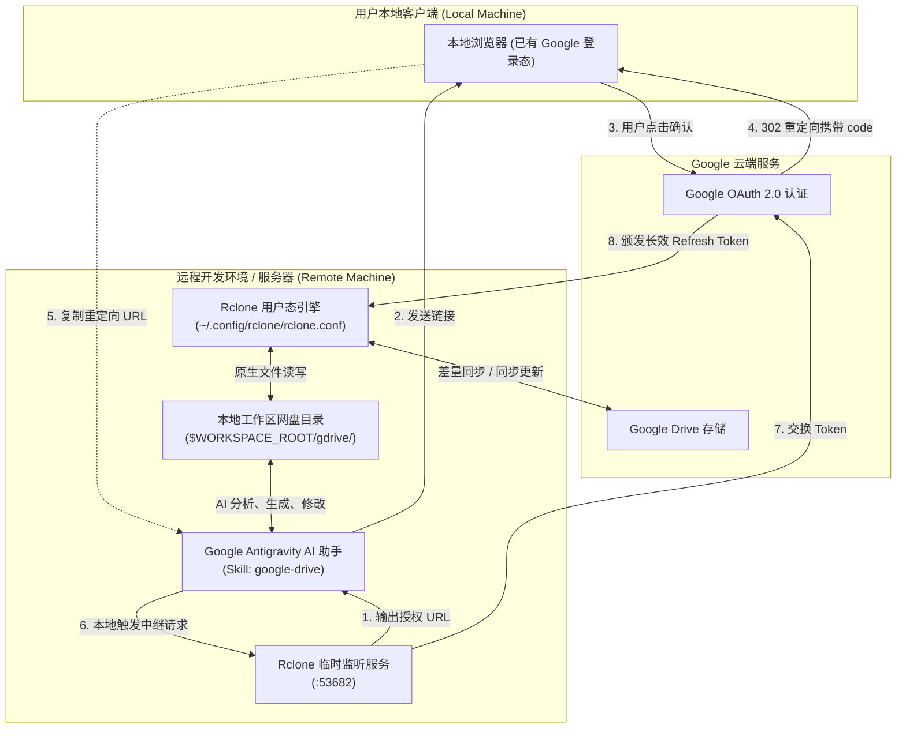

# Antigravity Google Drive Integration (Headless & Remote)

> 🚀 **专为远程开发环境与无头（Headless）场景打造的 Google Drive 与 AI 编程助手（Google Antigravity）深度打通方案。**

[](LICENSE)
[](#)
[](#)
[](#)

---

## 📖 背景与核心痛点

在现代软件研发与 AI 结对编程中，越来越多的开发者选择在**远程主机、云端开发机或无物理显示屏的 Mac / Linux 服务器**上运行 [Google Antigravity](https://antigravity.google) 等智能体助手。

当希望智能体读取、修改或归档保存在 Google Drive 上的技术方案、设计文档和代码时，常规途径往往会遇到以下阻碍：

1. **官方桌面客户端死锁**：macOS 系统级隐私机制（TCC）对后台进程的模拟输入（Accessibility）严格阻断，无法在无头/远程环境下通过脚本跳过首次启动的图形向导。
2. **GCP 自建 OAuth 门槛高、易过期**：在 Google Cloud Console 创建 OAuth 凭证流程繁琐，且测试模式下的令牌每 7 天就会被强制失效。
3. **FUSE 虚拟挂载不稳定**：依赖第三方内核扩展（如 macFUSE），在现代系统（如 Apple Silicon）上需要降低系统安全等级，弱网下还极易造成 I/O 挂死。

---

## 💡 本方案核心特性

本项目提供了一套经过生产验证的轻量级闭环方案：

- ⚡️ **100% 无头环境友好**：无需物理显示屏，无需任何 VNC 或远程桌面支持。
- 🔑 **逆向中继授权（Reverse Relay）**：利用本地已登录 Google 账号的浏览器，仅需一次点击与 URL 复制，10 秒内完成 OAuth 2.0 握手闭环。
- 🛡️ **长效免维护**：生成长效 `refresh_token`，由底层引擎在后台静默自动续期，告别 7 天过期困扰。
- 📦 **按需获取与零磁盘膨胀**：支持基于元数据在线速览（cat/lsf），拒绝无节制全量下载，有效防止媒体与海量文档侵占本地磁盘。
- ⏳ **多轮会话延迟同步（Deferred Sync）**：本地任务多轮迭代沉浸编辑，避免中间草稿污染云端历史，待交付或用户明确指令后再精准推送到云端。
- 🤖 **深度集成 Antigravity Skill**：提供开箱即用的 Antigravity 技能，让 AI 自然语言理解“按需拉取”、“备份设计方案”等意图。

---

## 🏗️ 架构全景



---

## 🚀 3 分钟快速落地指南

### 第一步：获取与安装工具

克隆本仓库并在远程机器上运行安装脚本：
```bash
git clone https://github.com/gcxixi/antigravity-gdrive.git
cd antigravity-gdrive

# 自动检测架构并安装 rclone
./scripts/setup_rclone.sh
```

### 第二步：无头 OAuth 逆向中继授权

1. 在远程机器终端执行无头授权监听：
   ```bash
   rclone authorize "drive" --auth-no-open-browser
   ```
2. 提取终端输出中形如 `http://127.0.0.1:53682/auth?state=...` 的链接，读取实际 Google 授权 URL：
   ```bash
   curl -s -i "http://127.0.0.1:53682/auth?state=<你的state>" | grep -i "location:"
   ```
3. 在你的**本地电脑浏览器**中打开提取出来的 Google 授权页面，登录并点击 **「允许」**。
4. 授权后，浏览器重定向到 `http://127.0.0.1:53682/?state=...&code=...`（页面显示“连接失败”属正常现象）。
5. **复制浏览器地址栏的整段 URL**，在远端机器上发起一次本地请求完成闭环：
   ```bash
   curl -s "<你复制的完整URL>"
   ```
6. 远端终端将瞬间输出凭证 JSON，直接将其写入配置文件：
   ```bash
   mkdir -p ~/.config/rclone
   cat << 'EOF' > ~/.config/rclone/rclone.conf
   [gdrive]
   type = drive
   scope = drive
   token = <粘贴你的Token JSON>
   EOF
   chmod 600 ~/.config/rclone/rclone.conf
   ```

### 第三步：验证连通与按需查看

```bash
# 测试列出网盘顶层目录
rclone lsf gdrive:

# 检查网盘与本地存储状态
./scripts/sync_gdrive.sh status

# 在线直接查看指定远端文件（零磁盘占用）
./scripts/sync_gdrive.sh cat docs/topics/clickhouse/readme.md
```

### 第四步：启用 Antigravity Skill

将本仓库提供的技能文件复制到全局 Antigravity 配置目录：
```bash
mkdir -p ~/.gemini/config/skills/google-drive
cp skills/google-drive/SKILL.md ~/.gemini/config/skills/google-drive/
```

现在，打开 Antigravity 对话框，你可以直接对 AI 助手说：
- *“帮我看下 gdrive 里的最新技术方案文档”*
- *“把刚刚生成的数据库对比报告保存到 gdrive/reports/ 并同步上云”*

---

## 📚 详细专题文档

- [01. 架构选型与无头环境困境深度剖析](docs/01-architecture-and-tradeoffs.md)
- [02. 无头环境下的 OAuth 2.0 握手闭环技巧](docs/02-headless-oauth-handshake.md)
- [03. Antigravity 智能体技能（Skill）深度集成](docs/03-antigravity-skill-integration.md)
- [04. 常见问题、排错指南与最佳实践 (FAQ)](docs/04-troubleshooting-and-faq.md)

---

## 🛠️ 内置辅助脚本

| 脚本文件 | 作用说明 |
| :--- | :--- |
| [`scripts/setup_rclone.sh`](scripts/setup_rclone.sh) | 跨平台自动化安装脚本（支持 macOS Apple Silicon/Intel、Linux x86/ARM） |
| [`scripts/sync_gdrive.sh`](scripts/sync_gdrive.sh) | 双向同步辅助工具（支持 `pull`、`push`、`status`、`list`） |

---

## 🔒 隐私与安全性

- **零敏感数据硬编码**：本项目所有代码与配置均使用环境变量与标准占位符，不包含任何个人凭证或私有路径。
- **本地存储原则**：OAuth 令牌只存储在当前机器的本地用户主目录下，网络通信严格直连 Google 官方 API，不经过任何第三方代理服务器。

---

## 📄 开源许可证

本项目基于 [MIT License](LICENSE) 开源。
