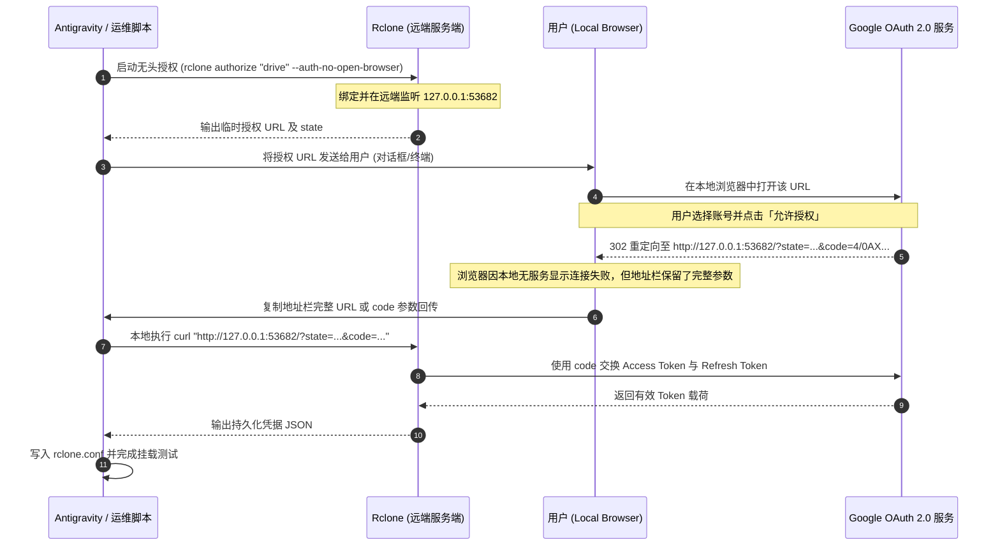

# 无头环境下的 OAuth 2.0 握手闭环技巧

在没有图形界面、无法直接访问远程机器本地端口的场景下，如何完成 Google OAuth 2.0 认证？

本文档详解本项目所采用的 **“无头监听 + 逆向中继（Reverse Relay）”** 握手技术。该方案不需要配置复杂的 SSH 端口转发，也不需要公网反向代理，普通用户只需 10 秒即可顺畅完成。

---

## 1. 核心困境：网络拓扑隔离

标准的 OAuth 2.0 Desktop / Loopback 流程假设用户、浏览器与接收回调的应用程序都在**同一台本地机器**上：

```
[Local Machine]
Google Drive App / Rclone (监听 127.0.0.1:53682) <---+
         |                                           |
         v 打开本地浏览器                              | 回调
浏览器 (accounts.google.com) ---- 用户授权完毕 ------>+
```

但在远程开发或云端使用 AI 智能体时，拓扑发生了割裂：
- **服务端（Server）**：位于远端（Remote Mac / Linux），无法直接弹出你的本地浏览器；
- **客户端（Client）**：你的当前电脑，只有浏览器具有 Google 账号登录态；
- **回路中断**：当客户端浏览器在 `accounts.google.com` 授权完毕后，Google 会指示浏览器重定向至 `http://127.0.0.1:53682/?code=...`。由于客户端电脑本地并没有运行监听该端口的程序，浏览器会立即提示：**“无法访问此网站 / ERR_CONNECTION_REFUSED”**。

---

## 2. 握手闭环时序与逆向中继解法

本项目利用了一个关键特性：**即使浏览器请求 127.0.0.1 失败，浏览器地址栏中的完整重定向 URL（含 `state` 和 `code`）依然被完整保留！**

通过将该 URL 传回远端服务端，服务端本地发起内部请求，即可瞬间闭环握手。

### 交互时序图 (Mermaid)



---

## 3. 分步操作实战指南

### 第一步：在远端启动无头监听
在远程机器的终端执行：
```bash
rclone authorize "drive" --auth-no-open-browser
```
输出形如：
```text
NOTICE: Please go to the following link: http://127.0.0.1:53682/auth?state=<generated_state>
NOTICE: Log in and authorize rclone for access
NOTICE: Waiting for code...
```

### 第二步：获取真实的 Google 认证跳转地址
直接通过 `curl` 读取远端监听端口返回的重定向目标：
```bash
curl -s -i "http://127.0.0.1:53682/auth?state=<提取的state>" | grep -i "location:"
```
你将得到一条形如下方的真实 Google 授权链接：
```
https://accounts.google.com/o/oauth2/auth?access_type=offline&client_id=202264815644.apps.googleusercontent.com&redirect_uri=http%3A%2F%2F127.0.0.1%3A53682%2F&response_type=code&scope=https%3A%2F%2Fwww.googleapis.com%2Fauth%2Fdrive&state=<generated_state>
```

### 第三步：在本地浏览器授权
在本地电脑直接打开上述链接，点击「允许 / 授权」。
授权完成后，浏览器会跳向类似：
```
http://127.0.0.1:53682/?state=<state_token>&iss=https://accounts.google.com&code=<authorization_code>&scope=https://www.googleapis.com/auth/drive
```
此时页面虽报连接失败，但**完整 URL 已经具备**。

### 第四步：在远端触发闭环
直接将复制下来的整段 URL 发送给服务端，并在服务端终端执行一次 `curl`：
```bash
curl -s "http://127.0.0.1:53682/?state=<你的state>&code=<你的code>&scope=https://www.googleapis.com/auth/drive"
```

远端进程瞬间输出：
```text
NOTICE: Got code
Paste the following into your remote machine --->
{"access_token":"ya29...","token_type":"Bearer","refresh_token":"1//...","expiry":"..."}
<---End paste
```

将该 JSON 保存至 `~/.config/rclone/rclone.conf`，即可长期持久化授权。
